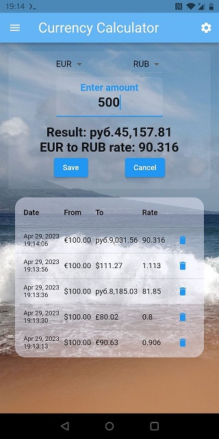
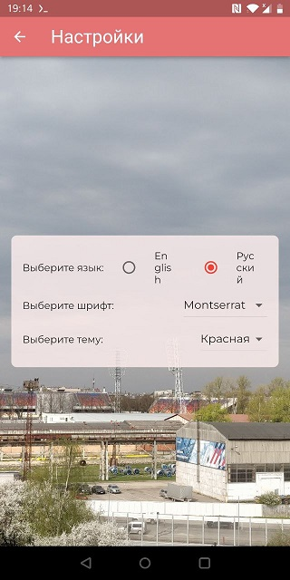

# Currency Calculator

My 1st experiment with flutter and dart in April of 2023.

This is a simple demo app for currency conversion. It supports two languages: English and Russian.

Module logic is separated to application, infrastructure and domain layers. 
I think, the "package by feature" style (aka the ["feature first"](https://codewithandrea.com/articles/flutter-project-structure/)) could look like this :)   

Logic is separated to features, and each feature has its own folder with all layers inside.
Features do not call each other, except the "Front" feature, which defines the application entry point and general configuration of appearance.

Application layer calls logic from the Infrastructure and Domain layer. Presentation logic is located in the Application layer in the "view" folders.
Infrastructure layer calls logic from Domain layer. It contains logic that accesses external resources, such as API, database, etc.
Domain layer operates only in bounds of its own space. It is pure functional core with business logic and data models.

Most important business logic is located in the "Conversion" feature,
and it handles the Currency Calculator and the Conversion History screens.

**Infrastructure layer** is responsible for the currency exchange rate loading by API, 
and for the currency conversion history storage in the [Hive](https://docs.hivedb.dev/) database.

Rate fetchers implement common interface and are provided by factory.
**Application layer** operates by this interface and provides the currency exchange rate to the UI.
It translates with help of localization package, and format currency amounts and numbers with help of the [Intl](https://pub.dev/packages/intl) package.  
Preferred color theme can be configured in settings. Theme is applied to the whole app.
Custom colors are added with help of [theme extension](https://api.flutter.dev/flutter/material/ThemeExtension-class.html).

**Domain layer** validates input values and calculates the currency conversion.

We have unit tests for validation and few functional tests for checking application view.

## Install

```sh
# Install dependencies
flutter pub get
# Generate project code
flutter create -t app .
```

## Build

`<uses-permission android:name="android.permission.INTERNET" />` is added 
to the `android/app/src/main/AndroidManifest.xml` file, because application uses the network.

```sh
flutter build apk --no-tree-shake-icons 
```

## Screens





## Links

* [Flutter App Architecture with Riverpod](https://codewithandrea.com/articles/flutter-app-architecture-riverpod-introduction/)
* [Folder structure for Flutter with clean architecture. How I do.](https://felipeemidio.medium.com/folder-structure-for-flutter-with-clean-architecture-how-i-do-bbe29225774f)
* [Style guide for Flutter repo](https://github.com/flutter/flutter/wiki/Style-guide-for-Flutter-repo)
* [Internationalizing Flutter apps](https://docs.flutter.dev/development/accessibility-and-localization/internationalization)
* [Flutter 3: How to extend ThemeData](https://medium.com/geekculture/flutter-3-how-to-extend-themedata-56b8923bf1aa)
