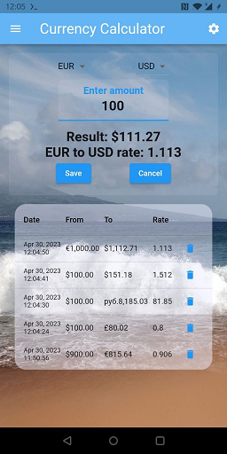
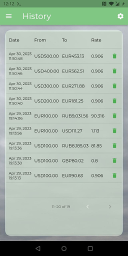
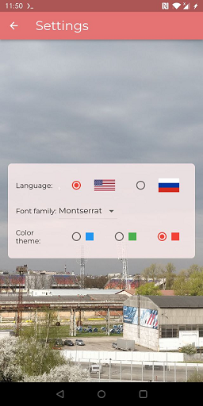
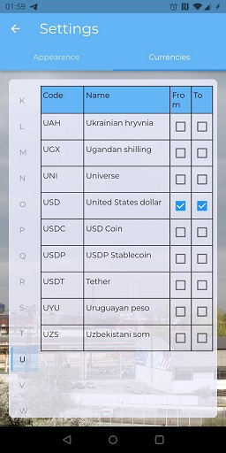

# Currency Calculator

My 1st experiment with flutter and dart in April of 2023.  
This is a simple demo app for currency conversion.

## Architecture

Project structure is organized by the the ["feature first"](https://codewithandrea.com/articles/flutter-project-structure/) style.

Feature internal logic is located in the `/lib/feature/<feature_name>/internal/` folder.
It is separated to ui, application, infrastructure and domain layers.
See namespaces structure in folder tree view in the [lib/ tree](doc/lib_tree.md) document.

**Presentation layer** is located in the `/ui` folders. It can call logic of the Application and Domain layers.

**Application layer** (`/app`) can call logic of the Infrastructure (`/infra`) and Domain (`/domain`) layers.

**Infrastructure layer** can call logic of Domain layer.
It contains logic that accesses external resources, such as API, database, etc.

**Domain layer** operates only in bounds of its own space.
It is pure functional core with business logic, entities and data models.

### Feature communication and dependency injection

Each feature defines published API for inter-feature communication.
It can be found in the facade class in `/lib/feature/<feature_name>/public/<feature_name>_facade.dart` class.
Features should not call each other directly, but only through the public API.

Each feature has its own dependency injection container, 
that is located in the `/lib/feature/<feature_name>/internal/app/init/<feature_name>_feature_dic.dart` class.
It doesn't use any DI package, but it assembles dependencies manually and explicitly.

In case, if feature needs some kind of its out-of-process services initialization, like DB,
this task is handled by the class located in `/lib/feature/<feature_name>/internal/app/init/<feature_name>_feature_initializer.dart`.

Dependency injection container and feature initializer are started by the feature facade.
Feature facades are injected into the application logic with help of [Provider](https://pub.dev/packages/provider) package.

### Shared code

Features can call widgets located in the `/lib/front` namespace, where we define common widgets,
the application entry point and general configuration of UI appearance.
Application bootstrapping logic is in the `/lib/front/app/boot/` folder.

## Features

You can find there the next features:

* **Conversion** - calculates currency conversion according to the exchange rate.
* **History** - displays the history of currency conversions.
* **Currency** - provides the list of available currencies and its configuration.
* **Settings** - allows to configure application appearance.
* **About** - displays information about the application.

### Currency Conversion feature

Most important business logic is located in the Conversion feature.
It handles the currency exchange rate calculation at the [Calculator screen](https://github.com/tnsoftbear/flutter_currency_calculator/blob/main/lib/feature/conversion/internal/ui/screen/calculator_screen.dart).

**Infrastructure layer** is responsible for the currency exchange rate loading by API.
It caches retrieved exchange rate in the [Hive](https://docs.hivedb.dev/) DB.
The lifetime of cached data is set to 1 day in configuration object. 
DB access methods are encapsulated in the repository classes.

Rate fetchers implement common interface and are provided by factory.
**Application layer** operates by this interface and provides the currency exchange rate to the UI.
It translates with help of localization package, and format currency amounts 
and exchange rate numbers with help of the [Intl](https://pub.dev/packages/intl) package.  

**Domain layer** validates input values and calculates the currency conversion.

### History feature

Application allows you to save currency conversion to the history and display it in the [History screen](https://github.com/tnsoftbear/flutter_currency_calculator/blob/main/lib/feature/history/internal/ui/screen/all_history_screen.dart).

Additionally, it displays the last 5 conversions at the Calculator screen in the bottom the Last History widget.
This history widget is constructed with help of [FutureBuilder](https://api.flutter.dev/flutter/widgets/FutureBuilder-class.html),
because it depends on data loaded by async call.
Since the history widget is updated after the saving of currency conversion, 
it is notified about the change with help of the [Provider](https://pub.dev/packages/provider) package.
The Last History widget is a part of the History feature and it is exposed 
by the respective facade class [HistoryFeatureFacade](https://github.com/tnsoftbear/flutter_currency_calculator/blob/main/lib/feature/history/public/history_feature_facade.dart),
so it can be called by the Conversion feature.

### Settings feature

Settings screen allows to configure several options:  

* Application supports two languages: English and Russian. They define appropriate localization.
* Preferred color is configurable by selection of the application theme. Theme is applied to the whole app.
Custom colors are added with help of [theme extension](https://api.flutter.dev/flutter/material/ThemeExtension-class.html).
* Font family is configured there as well.
* Define available currencies displayed at the Calculator screen.

Settings are stored with help of the [Shared preferences](https://pub.dev/packages/shared_preferences) package.

### Currency feature

Currency feature provides the list of available currencies that are fetched from the public API.
Big thanks to the [fawazahmed0/currency-api](https://github.com/fawazahmed0/currency-api) repository
for providing the currency list and the actual exchange rate.

To understand idea how features share data between each other, you can look to [CurrencyFeatureFacade](https://github.com/tnsoftbear/flutter_currency_calculator/blob/main/lib/feature/currency/public/currency_feature_facade.dart) class.
Here you can find some data query methods, that provide information about available currencies from DB source internal to the Currency feature.
Other feature do not access Currency feature DB directly, but call these public API methods instead.  
This facade class also provides a command method for initiating currency database updates.  
It also provides the method for accessing one widget component from UI layer.
The Settings feature calls it to display the list of available currencies in the Settings screen. 

You might be interested to review the way how do we prepare internal dependencies for the feature usage.
Look to the [CurrencyFeatureDic](https://github.com/tnsoftbear/flutter_currency_calculator/blob/main/lib/feature/currency/internal/app/init/currency_feature_dic.dart) class.
It build dependency graph and pass dependencies down to the internal layers.
This dependency assembling logic is called once at top layer of application [Bootstrapper](https://github.com/tnsoftbear/flutter_currency_calculator/blob/main/lib/front/app/boot/bootstrapper.dart) and is used in the CurrencyFeatureFacade too.

## Tests

There are few unit tests for conversion input validation and calculation logic.

## Run

### Install

```sh
# Install dependencies
flutter pub get
# Generate project code
flutter create -t app .
```

### Build

`<uses-permission android:name="android.permission.INTERNET" />` is added 
to the `android/app/src/main/AndroidManifest.xml` file, because application uses the network.

```sh
flutter build apk --no-tree-shake-icons
```

### Develop

Few reminders for myself:

```sh
# Generate code
flutter pub run build_runner build --delete-conflicting-outputs
# Generate translation classes
flutter gen-l10n
```

#### Document

```sh
# Generate lib/ folder tree in Windows
echo ```sh > ./doc/lib_tree.md & echo lib >> ./doc/lib_tree.md & tree /F /A lib | more +3 >> ./doc/lib_tree.md & echo ``` >> ./doc/lib_tree.md
```

#### TODO

* [ ] Riverpod(?)
* [ ] More DI
* [ ] Swipe screens (History <- Calculator -> Settings)
* [ ] Tests
* [ ] Compare exchange rate with past dates
* [ ] App icon
* [ ] Notes

## Screens






## Links

* [Flutter App Architecture with Riverpod](https://codewithandrea.com/articles/flutter-app-architecture-riverpod-introduction/)
* [Folder structure for Flutter with clean architecture. How I do.](https://felipeemidio.medium.com/folder-structure-for-flutter-with-clean-architecture-how-i-do-bbe29225774f)
* [Style guide for Flutter repo](https://github.com/flutter/flutter/wiki/Style-guide-for-Flutter-repo)
* [Internationalizing Flutter apps](https://docs.flutter.dev/development/accessibility-and-localization/internationalization)
* [Flutter 3: How to extend ThemeData](https://medium.com/geekculture/flutter-3-how-to-extend-themedata-56b8923bf1aa)

---

(c) 2023, github.com/tnsoftbear
